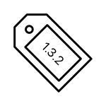

# Release Tag

This project is targeted for exporting to various icons.

## Exported files
* macOS/Assets.xcassets/AppIcon.appiconset/icon16.png
* macOS/Assets.xcassets/AppIcon.appiconset/icon1024.png
* macOS/Assets.xcassets/AppIcon.appiconset/icon512.png
* macOS/Assets.xcassets/AppIcon.appiconset/icon128.png
* macOS/Assets.xcassets/AppIcon.appiconset/icon64.png
* macOS/Assets.xcassets/AppIcon.appiconset/icon256.png
* macOS/Assets.xcassets/AppIcon.appiconset/icon32.png
* iOS/Assets.xcassets/AppIcon.appiconset/icon167.png
* iOS/Assets.xcassets/AppIcon.appiconset/icon29.png
* iOS/Assets.xcassets/AppIcon.appiconset/icon1024.png
* iOS/Assets.xcassets/AppIcon.appiconset/icon60.png
* iOS/Assets.xcassets/AppIcon.appiconset/icon76.png
* iOS/Assets.xcassets/AppIcon.appiconset/icon58.png
* iOS/Assets.xcassets/AppIcon.appiconset/icon40.png
* iOS/Assets.xcassets/AppIcon.appiconset/icon80.png
* iOS/Assets.xcassets/AppIcon.appiconset/icon87.png
* iOS/Assets.xcassets/AppIcon.appiconset/icon120.png
* iOS/Assets.xcassets/AppIcon.appiconset/icon152.png
* iOS/Assets.xcassets/AppIcon.appiconset/icon20.png
* iOS/Assets.xcassets/AppIcon.appiconset/icon180.png
* tvOS/Assets.xcassets/App Icon & Top Shelf Image.brandassets/App Icon - App Store.imagestack/Front.imagestacklayer/Content.imageset/front.pdf
* tvOS/Assets.xcassets/App Icon & Top Shelf Image.brandassets/App Icon - App Store.imagestack/Back.imagestacklayer/Content.imageset/back.pdf
* tvOS/Assets.xcassets/App Icon & Top Shelf Image.brandassets/App Icon.imagestack/Front.imagestacklayer/Content.imageset/front.pdf
* tvOS/Assets.xcassets/App Icon & Top Shelf Image.brandassets/App Icon.imagestack/Back.imagestacklayer/Content.imageset/back.pdf
* tvOS/Assets.xcassets/App Icon & Top Shelf Image.brandassets/Top Shelf Image Wide.imageset/wide.pdf
